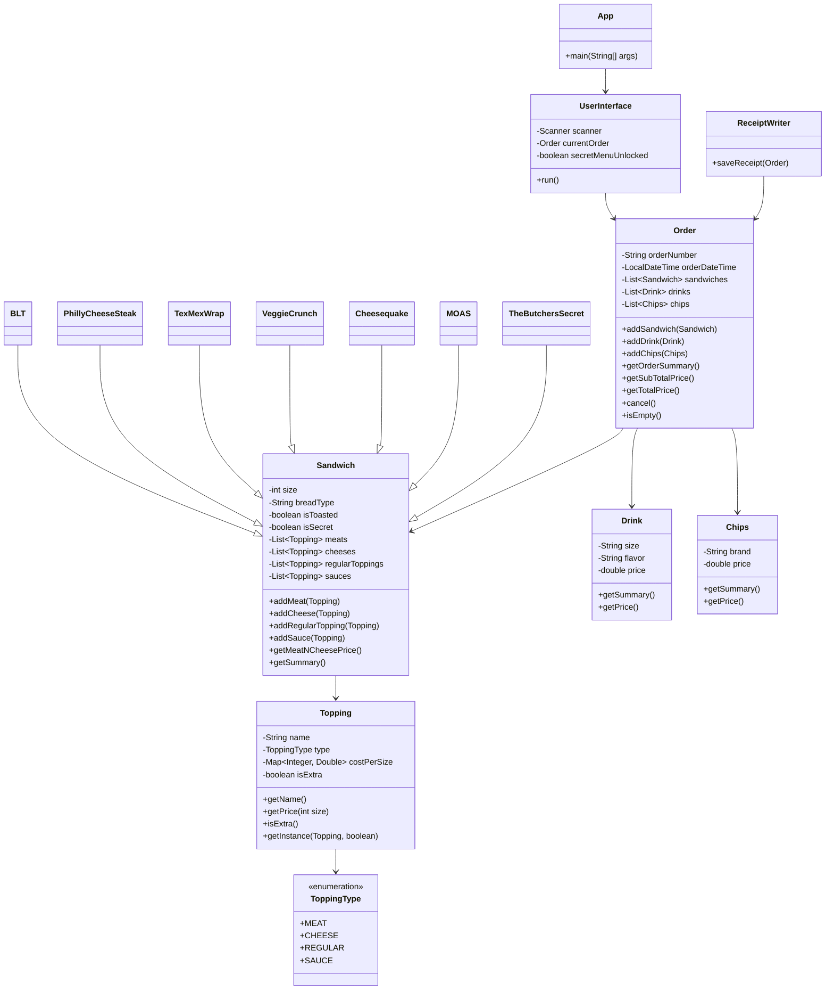

<h1 align="center">🥪 Welcome to the Bread 'n Bytes Sandwich Shop!</h1>

## 📋 Description
Bread 'n Bytes is a CLI-based application built in Java that simulates a point-of-sale system for a sandwich shop. Customers can create and fully customize their orders, choosing from various sandwich sizes, breads, toppings, drinks, and chips. Receipts are generated and saved for every order. The shop supports both custom and signature sandwich options. This application is meant to demonstrate various object-oriented programming (OOP) principles such as encapsulation, inheritance and polymorphism. 

---

## 💻 Features
- 🏠 [Home Screen](#home-screen) - Start a new order & exit the application 
- 📋 [Order Menu](#order-menu) - Make a custom or signature sandwich; add drinks and chips; confirm or cancel order 
- 🥪 [Sandwich Building](#sandwich-building) - Choose bread, size, toast or not; add meat, cheese, regular toppings, sauces/sides
- 🥤 [Drinks](#drinks) - Choose size and from 12 different flavors
- 🥔 [Chips](#chips) - Choose from 9 brands
- 💵 [Checkout](#checkout) - Display complete order summary, confirm or cancel to save a receipt
- 🧾 [Receipt](#receipt) - Saves a separate receipt file every time an order is confirmed
- 🕵️ [Secret Menu](#secret-menu) - [Password](#password) locked and includes exclusive sandwiches
- Also view this [interesting piece of code](#-interesting-code) and the [class diagram](#-class-diagram) for the code structure.
---

## 📁 File Structure

```
Bread-n-Bytes/
├── .idea/                         # IntelliJ project settings
├── Screenshots/                   # (Optional) Screenshots for documentation
├── src/                           
│   ├── main/
│   │   ├── java/
│   │   │   └── com.pluralsight/
│   │   │       ├── models/
│   │   │       │   ├── signatures/
│   │   │       │   │   └── secret/
│   │   │       │   │       ├── BLT.java
│   │   │       │   │       ├── PhillyCheeseSteakWrap.java
│   │   │       │   │       ├── TexMexWrap.java
│   │   │       │   │       └── VeggieCrunch.java
│   │   │       │   ├── Chips.java
│   │   │       │   ├── Drink.java
│   │   │       │   ├── Order.java
│   │   │       │   ├── Sandwich.java
│   │   │       │   ├── Topping.java
│   │   │       │   └── ToppingType.java
│   │   │       ├── userinterface/
│   │   │       │   └── UserInterface.java
│   │   │       ├── utilities/
│   │   │       │   └── ReceiptWriter.java
│   │   │       └── App.java
│   │   └── resources/
│   │       └── receipts/         # Receipt .txt files stored here
│   └── test/
│       └── java/                 # (Optional) Unit tests
├── target/                       # Compiled build output
├── .gitignore                    # Git ignore rules
├── class_diagram.png             # Class diagram image
├── pom.xml                       # Maven build configuration
└── README.md                     # Project documentation
```

---

## 📸 Example Screens

<span id="home-screen"></span>
<h3 align="center">Home Screen</h3>

<div align="center">
  <table width="100%">
    <tr>
      <td align="center">
        
        <br/>
  </table>
</div>


<br/>
<span id="order-menu"></span>
<h3 align="center">Order Screen</h3>

<div align="center">
  <table width="100%">
    <tr>
      <td align="center">
        
        <br/>
  </table>
</div>


<br/>
<span id="sandwich-building"></span>
<h3 align="center">Sandwich Building</h3>

<table>
  <tr>
    <td align="center" width="500">
      <br/>
      <sub><i>Adding a Sandwich</i></sub>
    </td>
    <td align="center" width="500">
      <br/>
      <sub><i>Choosing Bread Type</i></sub>
    </td>
  </tr>
</table>

<table>
  <tr>
    <td align="center" width="500">
      <br/>
      <sub><i>Choosing Bread Size</i></sub>
    </td>
    <td align="center" width="500">
      <br/>
      <sub><i>Adding Meats</i></sub>
    </td>
  </tr>
</table>

<table>
  <tr>
    <td align="center" width="500">
      <br/>
      <sub><i>Adding Cheese</i></sub>
    </td>
    <td align="center" width="500">
      <br/>
      <sub><i>Adding Regular Toppings</i></sub>
    </td>
  </tr>
</table>

<table>
  <tr>
    <td align="center" width="500">
      <br/>
      <sub><i>Adding Sauces & Sides</i></sub>
    </td>
    <td align="center" width="500">
      <br/>
      <sub><i>Signature Sandwich Screen</i></sub>
    </td>
  </tr>
</table>

<div align="center">
  <table width="100%">
    <tr>
      <td align="center">
        
        <br/>
        <sub><i>Choosing a Signature Sandwich</i></sub>
      </td>
  </table>
</div>


<br/>
<span id="drinks"></span>
<h3 align="center">Drinks</h3>

<table>
  <tr>
    <td align="center" width="500">
      <br/>
      <sub><i>Adding Drink Flavor</i></sub>
    </td>
    <td align="center" width="500">
      <br/>
      <sub><i>Adding Drink Size</i></sub>
    </td>
  </tr>
</table>


<br/>
<span id="chips"></span>
<h3 align="center">Chips</h3>

<div align="center">
  <table width="100%">
    <tr>
      <td align="center">
        
        <br/>
  </table>
</div>


<br/>
<span id="checkout"></span>
<h3 align="center">Checkout</h3>

<div align="center">
  <table width="100%">
    <tr>
      <td align="center">
        
        <br/>
  </table>
</div>


<br/>
<span id="receipt"></span>
<h3 align="center">Receipt</h3>

<div align="center">
  <table width="100%">
    <tr>
      <td align="center">
        
        <br/>
  </table>
</div>


<br/>
<span id="secret-menu"></span>
<h3 align="center">Secret Menu</h3>

<div align="center">
  <table width="100%">
    <tr>
      <td align="center">
        
        <br/>
  </table>
</div>

---

## 💡 Interesting Code

The `getInstance` method solves a significant potential issue in the code when considering toppings as extra. This allows me to create a new example of a topping object that can be called 'extra' and have its price changed without making a duplicate. This fits well by not compromising the natural integrity of the topping objects. Without this, toppings would possibly have to be made as separate static objects to accomodate them as extras or the code might lose security with type accuracy due to using strings instead.

```java
public static Topping getInstance(Topping topping, boolean isExtra) {
        Topping newTopping = new Topping(topping.name, topping.type, topping.costPerSize);
        newTopping.isExtra = isExtra;
        return newTopping;
}
```

---

## 🧩 Class Diagram



---
<span id="password"></span>

<p align="center"><em>Secret Menu Password: <code>iluvfood</code></em></p>

